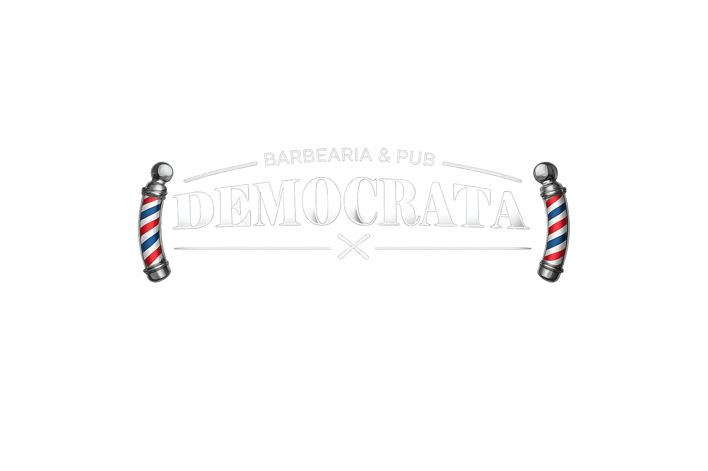
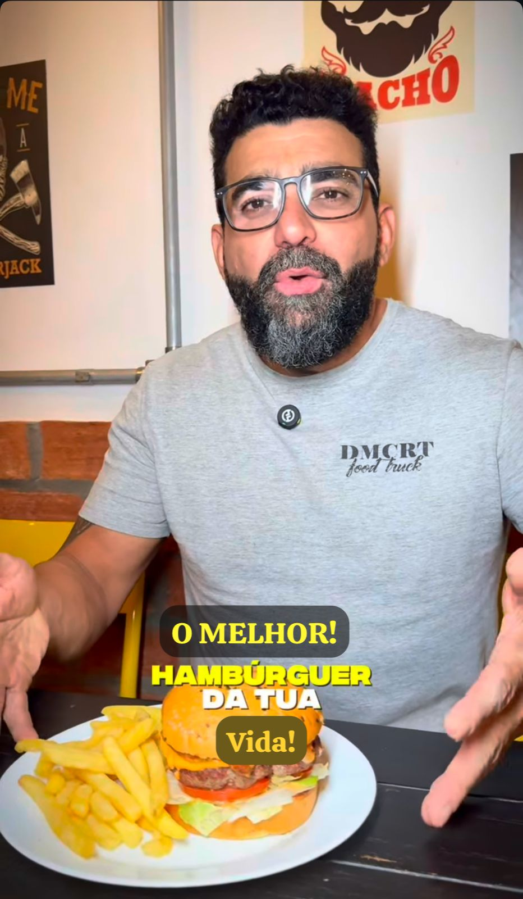

# 📁 GUIA DE ORGANIZAÇÃO - Imagens Oficiais Democrata

## 🎯 Estrutura Final das Pastas

```
assets/
├── logo/
│   ├── logo.png                    ← Imagem 1 (logo transparente)
│   └── logo-perfil.png             ← Imagem 5 (logo circular)
├── hero/
│   └── hero-bg.jpg                 ← Imagem 2 (burger artesanal)
├── foodtruck/
│   ├── foodtruck-banner.jpg        ← Imagem 3 (banner food truck)
│   └── foodtruck-exterior.jpg      ← (imagem existente)
├── ambiente/
│   ├── barbearia-fachada.jpg       ← (imagem existente)
│   └── horario-funcionamento.jpg   ← Imagem 4 (horário + decoração)
└── menu/
    └── burger-destaque.jpg         ← (imagem existente)
```

## 📸 Mapeamento das Imagens

### Imagem 1: Logo Transparente
**Arquivo original:** `democratalogofundotransparente.png`
**Destino:** `assets/logo/logo.png`
**Uso:** Hero section principal

### Imagem 2: Burger Artesanal
**Arquivo original:** `hamburguer-e-coca-cola-fundo-barbearia-rustica.jpeg`
**Destino:** `assets/hero/hero-bg.jpg`
**Uso:** Background do hero

### Imagem 3: Food Truck Banner
**Arquivo original:** `horario-de-funcionamento-food-truck.jpeg`
**Destino:** `assets/foodtruck/foodtruck-banner.jpg`
**Uso:** Seção food truck

### Imagem 4: Horário Funcionamento
**Arquivo original:** `horarios-democrata-barbearia.jpeg`
**Destino:** `assets/ambiente/horario-funcionamento.jpg`
**Uso:** Referência + possível galeria

### Imagem 5: Logo Circular
**Arquivo original:** `logodemocratasemfundo.png`
**Destino:** `assets/logo/logo-perfil.jpg`
**Uso:** Perfil social, favicon

## 🔧 Comandos para Organizar

### Opção 1: Script Automático (Windows)
```bash
# Executar o arquivo:
ORGANIZAR-IMAGENS.bat
```

### Opção 2: Comandos Manuais
```bash
# Criar pastas
mkdir assets\foodtruck
mkdir assets\ambiente

# Mover logo
move assets\democratalogofundotransparente.png assets\logo\logo.png
move assets\logodemocratasemfundo.png assets\logo\logo-perfil.png

# Mover hero
move assets\hamburguer-e-coca-cola-fundo-barbearia-rustica.jpeg assets\hero\hero-bg.jpg

# Mover food truck
move assets\horario-de-funcionamento-food-truck.jpeg assets\foodtruck\foodtruck-banner.jpg

# Mover ambiente
move "assets\barbearia fachada-frente-e-idealizador.jpeg" assets\ambiente\barbearia-fachada.jpg
move assets\horarios-democrata-barbearia.jpeg assets\ambiente\horario-funcionamento.jpg

# Mover menu
move assets\omelhorhamburguerdasuavida.jpeg assets\menu\burger-destaque.jpg
```

## 🎨 Atualizações Necessárias no HTML

Após organizar as imagens, atualizar estes caminhos no `index.html`:

### Hero Section
```html

```

### Hero Background (CSS)
```css
background: url('assets/hero/hero-bg.jpg')
```

### Food Truck Section
```html

```

### Cardápio
```html

```

### Galeria
```html


```

## ✅ Checklist Pós-Organização

- [ ] Todas as imagens nas pastas corretas
- [ ] HTML atualizado com novos caminhos
- [ ] Testar visualização local
- [ ] Commit das alterações
- [ ] Push para GitHub
- [ ] Verificar no site online

## 🚀 Deploy

Após organizar:
```bash
git add .
git commit -m "📁 Organize images in structured folders"
git push
```

**Site ficará com todas as imagens oficiais no lugar certo!** 🎯
