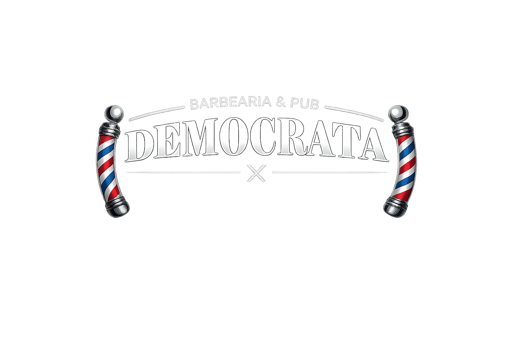

# Democrata

<p align="center">
  
</p>

<p align="center">
  Landing page institucional da Democrata com foco em burger artesanal, pub e barbearia.
</p>

## Visao Geral

Este repositorio concentra uma landing page estatica orientada a conversao para:

- iFood como canal principal de pedido
- WhatsApp para atendimento e agendamento
- Instagram e telefone como apoio de relacionamento

O projeto foi desenhado para ser simples de manter: poucos arquivos, deploy direto no GitHub Pages e validacao local antes da publicacao.

## Stack

- HTML5
- CSS3 com variaveis, grid, media queries e animacoes
- JavaScript vanilla
- PowerShell para validacao local
- Python `http.server` para preview
- GitHub Actions + GitHub Pages para deploy

## Estrutura

```text
.
|-- .github/
|   `-- workflows/deploy.yml
|-- assets/
|   |-- gallery/
|   |-- hero/
|   |-- logo/
|   `-- menu/
|-- scripts/
|   `-- validate-site.ps1
|-- index.html
|-- style.css
|-- script.js
|-- MANUAL-PROJETO.md
|-- ROADMAP.md
`-- package.json
```

## Estado Atual

Na revisao de 2026-03-29, os principais pontos observados foram:

- havia referencia quebrada para `assets/logo/logo-perfil.jpg`
- a hero usava uma imagem de campanha com pessoa, enquanto o texto e o `alt` descreviam um burger close-up
- a galeria estava com pouco aproveitamento do acervo e repetia um asset pouco coerente com a proposta visual
- o dock flutuante competia com o hero no desktop
- a documentacao citava caminhos de assets que nao existem mais
- o acervo possui duplicidades e nomes inconsistentes que ainda precisam de consolidacao

## Ajustes Aplicados Nesta Revisao

- correcao do logo do cabecalho para `assets/logo/logo-perfil1.jpg`
- troca da imagem principal da hero por um asset de produto coerente com a mensagem
- reorganizacao da galeria para incluir burgers, combo, ambiente e presenca da marca
- uso do poster de horarios dentro da secao de horarios, preenchendo melhor a composicao
- floating dock mantido apenas no mobile para reduzir poluicao visual no desktop
- README e manual alinhados com os assets realmente usados na pagina

## Auditoria de Design

Pontos fortes atuais:

- identidade noturna consistente
- hierarquia tipografica forte no hero e nas secoes principais
- CTA principal bem definido para iFood
- atmosfera visual alinhada com burger + pub + barbearia

Pontos de atencao:

- o site ainda depende bastante de animacoes de reveal para ganhar vida
- ha margem para otimizar contraste fino em alguns textos secundarios
- parte do acervo visual ainda esta dispersa entre fotos de produto, campanha e arquivos sem padrao de nomenclatura

## Auditoria de Imagens

Assets ativos na pagina depois desta revisao:

- `assets/logo/logo-perfil1.jpg`
- `assets/logo/nome-democrata.png`
- `assets/hero/hero-bg.jpg`
- `assets/menu/burguerdemocrata.jpg`
- `assets/menu/burguercareca.jpg`
- `assets/menu/combotriocareca.jpg`
- `assets/menu/triocompletodemocrata.jpg`
- `assets/menu/burguercorte.jpg`
- `assets/menu/sanduichleitaonabrasa.jpg`
- `assets/menu/food-truck-horarios.jpg`
- `assets/gallery/edisonlima.jpg`
- `assets/gallery/barbearia-interior.jpg`

Assets em revisao ou com sinal de inconsistencias:

- `assets/logo/logoperfil.jpg`
  arquivo mestre grande demais para uso web direto
- `assets/menu/omelhorburgue.jpg`
  duplicado de `assets/menu/burger-destaque.jpg`
- `assets/burguerdocareca.jpg`
  duplicado de `assets/menu/burguercareca.jpg`
- `assets/menu/combotriocareca`
  arquivo sem extensao

Recomendacao: manter os arquivos acima como acervo temporario ate uma limpeza dedicada, mas nao usa-los como referencia canonica do front.

## Rodando Localmente

Requisitos:

- Python 3
- Node.js

Comandos:

```bash
npm run dev
```

Preview local:

```text
http://localhost:3000
```

## Validacao

Antes de publicar:

```bash
npm run check
```

O script atual verifica:

- referencias locais em `src`, `href` e `data-image`
- assets usados em `url(...)` no CSS
- sinais comuns de texto com encoding corrompido

## Deploy

O deploy acontece pelo workflow:

- `.github/workflows/deploy.yml`

Publicacao:

- branch: `main`
- URL: `https://linksites.github.io/democrata/`

## Roadmap

O plano de evolucao desta landing esta em:

- `ROADMAP.md`

Resumo das proximas frentes:

- consolidar naming e limpeza de assets
- otimizar imagens pesadas
- reforcar SEO, Open Graph e analytics
- transformar cardapio e horarios em fonte unica de dados
- ampliar acessibilidade e governanca de conteudo

## Fluxo de Manutencao

```bash
git status --short
npm run dev
npm run check
```

Arquivos principais:

- `index.html`
- `style.css`
- `script.js`
- `assets/`
- `MANUAL-PROJETO.md`
